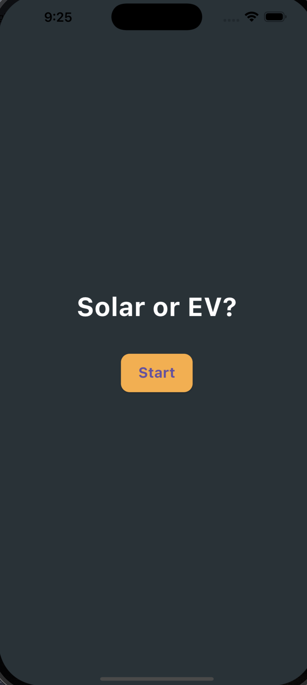

# 🌞 Solar vs EV — Decision Tree App

This Flutter app helps users decide whether investing in **solar panels** or an **electric vehicle** is the better fit based on their lifestyle, goals, and location.

Built as a learning project to practice clean UI, navigation, and decision-based logic using Dart + Flutter.

---

## 🚀 Features

- Clean welcome screen with a bold CTA
- Interactive decision tree (Yes/No flow)
- Smart logic using a custom `DecisionNode` model
- Navigation using `Navigator.push`
- Scalable file/folder structure (screens, models, data)

---

## 📱 Screenshots

| Intro Screen | Decision Screen |
|--------------|------------------|
|  |  |

---

## 🧠 What I Learned

- Flutter widget structure and layout
- Stateless vs Stateful Widgets
- Navigation with `Navigator.push`
- Creating and linking new screens
- Designing a data model (`DecisionNode`) for branching logic
- Writing clean, readable Dart code

---

## 📂 Folder Structure